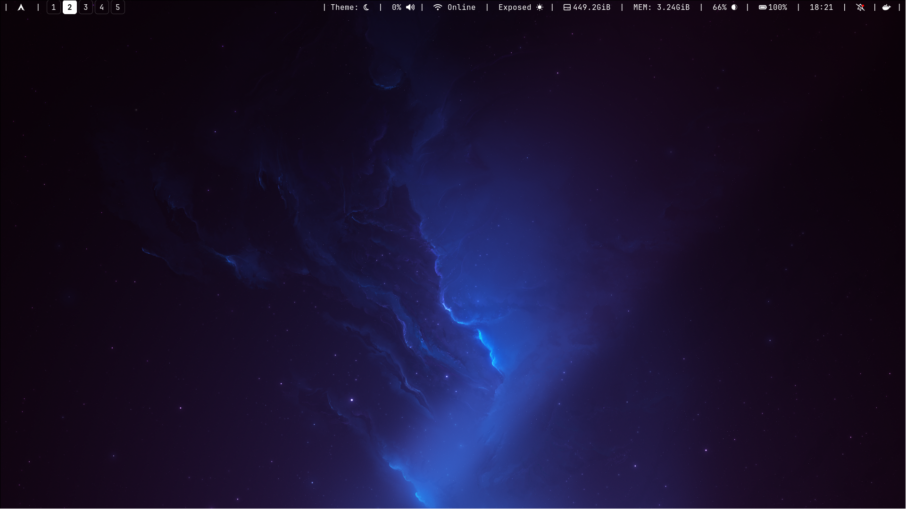

# My Arch + Hyprland Dotfiles

This is my configs running straight on **Arch Linux** with **Hyprland**. No bloated setups, just the minimal stuff I need for productivity.


# Requirements
Don't roll without these tho:
- Hyprland 
- Waybar
- Foot
- Wofi
- Cava
- Nerd Fonts
- Hyprpaper
- playerctl, brightnessctl
- hyprsunset
- neofetch

I aint writing allat ngl just go check ```pkglist.txt``` and  execute the command below
```bash
sudo pacman -S --needed - < pkglist.txt
```

# The FLex Zone(AKA themes)
You can just toggle between these using the custom waybar Theme toggle

### Nebula Detph 


### r3d


#### Renaissance


#### The Anatomy


#### Foot Terminal 


#### Waybar  


#### Wofi Launcher 


#### Theme Picker Menu
 


## Licence 
Take it and tweak it ion even care, still very minimal as i'm still finding my steps into Unix based OS